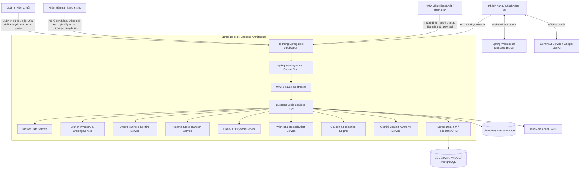
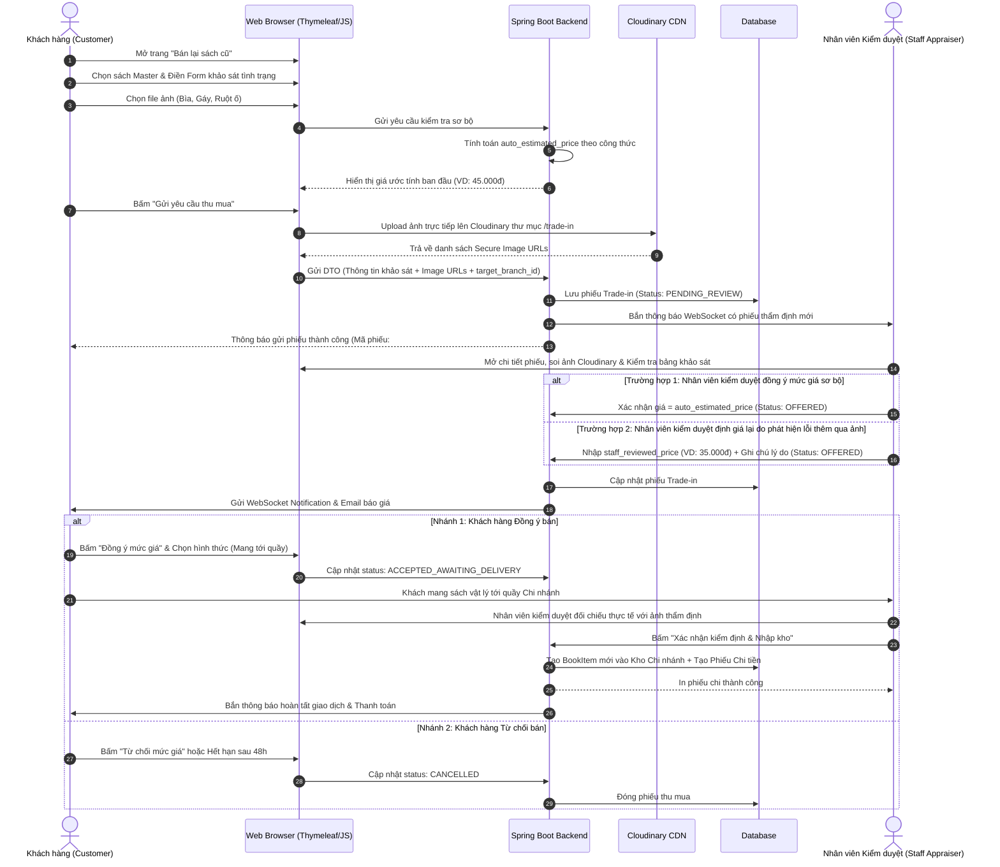
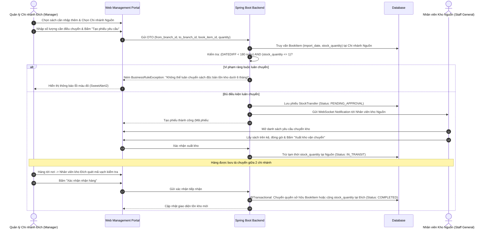

# TÀI LIỆU ĐẶC TẢ YÊU CẦU PHẦN MỀM (SRS)
## HỆ THỐNG QUẢN LÝ CHUỖI CỬA HÀNG SÁCH CŨ (OLD BOOKSTORE CHAIN MANAGEMENT SYSTEM)

---

| **Thuộc tính** | **Nội dung** |
| :--- | :--- |
| **Tên đề tài** | Xây dựng website quản lý chuỗi cửa hàng sách cũ đa chi nhánh |
| **Công nghệ áp dụng** | Spring Boot 3.x, Thymeleaf, Bootstrap 5, Spring Data JPA, SQL Server / MySQL / PostgreSQL, Spring Security + JWT, WebSocket (STOMP), Cloudinary API, Google Gemini AI API |
| **Môn học / Đồ án** | Đồ án Lập trình Web / Phân tích Thiết kế Hệ thống Thông tin |
| **Phiên bản tài liệu** | 2.1.0 (Bản đặc tả hoàn thiện - Phân định rõ Staff Kiểm duyệt & Staff Thường, Không Mục lục) |
| **Trạng thái** | Hoàn thiện & Phê duyệt (Approved) |

---

## 1. GIỚI THIỆU TỔNG QUAN

### 1.1. Mục đích tài liệu
Tài liệu Đặc tả Yêu cầu Phần mềm (SRS) này là bản mô tả kỹ thuật chi tiết nhất phục vụ xây dựng dự án **"Hệ thống Quản lý Chuỗi Cửa hàng Sách cũ"**. Tài liệu tập trung chuẩn hóa và tích hợp sâu **9 nhóm nghiệp vụ thực tế** của mô hình chuỗi bán lẻ sách cũ, bao gồm: Quản trị dữ liệu gốc, Quản lý tồn kho theo độ cũ, Phân bổ đơn hàng đa chi nhánh, Luân chuyển kho có ràng buộc, Săn sách tự động, Khuyến mãi linh hoạt, Thu mua thẩm định 2 chiều và Trợ lý ảo tư vấn thông minh sử dụng Google Gemini AI.

### 1.2. Phạm vi hệ thống
Hệ thống kết hợp giữa **E-commerce B2C**, **C2B Trade-in (Thu mua từ khách)** và **Hệ thống ERP thu nhỏ (Quản lý đa chi nhánh, luân chuyển kho, POS tại quầy)**:
- **Cổng khách hàng (Customer Portal):** Tìm kiếm đầu sách theo chi nhánh, xem ảnh thực tế độ hao mòn, đặt mua giao tận nơi hoặc giữ sách tại quầy, tạo yêu cầu bán lại sách cũ kèm khảo sát tình trạng, đăng ký nhận tin sách về kho, chat với Gemini AI hoặc nhân viên tư vấn.
- **Cổng nhân viên kiểm duyệt chi nhánh (Staff Appraiser Portal):** Tiếp nhận hồ sơ bán sách cũ từ khách hàng, soi ảnh Cloudinary, thẩm định chấm điểm Grade và ra giá mua, kiểm tra đối soát sách vật lý tại quầy khi khách mang đến, xác nhận nhập kho và tạo phiếu chi.
- **Cổng nhân viên bán hàng & vận hành chi nhánh (Staff General Portal):** Tiếp nhận đơn hàng online được điều phối, lấy sách trên kệ, đóng gói và in hóa đơn vận chuyển, bán hàng tại quầy POS, xử lý xuất/nhập phiếu luân chuyển kho.
- **Cổng quản trị chuỗi (Headquarters / Admin Portal):** Chuẩn hóa dữ liệu sách gốc (Master Data), cấu hình khuyến mãi, điều phối luân chuyển kho, quản lý chuỗi cửa hàng, phân quyền nhân sự và xem báo cáo tài chính tổng hợp.

### 1.3. Định nghĩa và từ viết tắt
| Thuật ngữ / Viết tắt | Ý nghĩa / Giải thích |
| :--- | :--- |
| **MDM (Master Data Management)** | Quản trị dữ liệu gốc: Danh mục tác giả, thể loại, đầu sách chuẩn duy nhất toàn chuỗi |
| **SKU / Book Item** | Bản sao vật lý cụ thể của một đầu sách tại một chi nhánh, gắn liền với một tình trạng độ cũ nhất định |
| **Grading Scale** | Thang phân loại tình trạng sách (LIKE_NEW 99%, VERY_GOOD 90%, GOOD 80%, ACCEPTABLE 60%, COLLECTIBLE) |
| **Order Routing / Splitting** | Cơ chế tự động định tuyến và tách đơn hàng mẹ thành nhiều đơn hàng con theo từng chi nhánh có hàng |
| **Internal Transfer** | Luân chuyển sách giữa các chi nhánh có kèm ràng buộc điều kiện tồn kho |
| **Trade-in / Buy-back** | Quy trình thu mua lại sách cũ từ độc giả: Khảo sát $\rightarrow$ Giá sơ bộ $\rightarrow$ Thẩm định $\rightarrow$ Nhập kho |
| **Gemini AI Chatbot** | Trợ lý ảo tích hợp Google Gemini API đóng vai trò thủ thư tư vấn dựa trên dữ liệu sách thực tế |
| **JWT (JSON Web Token)** | Chuỗi xác thực stateless lưu trữ bảo mật qua HttpOnly Secure Cookie |
| **WebSocket / STOMP** | Giao thức truyền thông hai chiều thời gian thực phục vụ Chat và Bắn thông báo tức thì |

---

## 2. MÔ TẢ TỔNG QUAN HỆ THỐNG & KIẾN TRÚC ĐA CHI NHÁNH

### 2.1. Bối cảnh và mô hình nghiệp vụ chuỗi sách cũ
Mô hình chuỗi cửa hàng sách cũ có các bài toán nghiệp vụ đặc thù:
1. **Dữ liệu phân tầng (2-Tier Book Architecture):** Cần phân biệt rõ giữa *Đầu sách gốc (Book Master)* (thông tin cố định: ISBN, tên sách, tác giả, giá bìa) và *Mặt hàng thực tế (Book Item)* (tình trạng cũ mới, giá bán riêng, ảnh chụp thực tế góc cạnh vết ố, chi nhánh lưu trữ).
2. **Luân chuyển kho có điều kiện:** Hàng ế ở chi nhánh này có thể được điều chuyển sang chi nhánh khác có nhu cầu, nhưng phải tuân thủ điều kiện chặn luân chuyển đối với sách mới nhập kho dưới 6 tháng mà số lượng chỉ có 1 bản duy nhất.
3. **Phân bổ đơn hàng (Order Splitting):** Khách hàng có thể mua 2 cuốn sách trong cùng 1 giỏ hàng nhưng 1 cuốn ở Chi nhánh Quận 1 và 1 cuốn ở Chi nhánh Hà Nội $\rightarrow$ Hệ thống tự động tách làm 2 đơn con và điều phối nhân viên từng chi nhánh xử lý.



### 2.2. Phân loại tác tử (Actors) và Ma trận phân quyền chi tiết

1. **GUEST (Khách vãng lai):** Xem danh mục sách, xem chi tiết ảnh vết ố của sách cũ tại từng chi nhánh, chat với Gemini AI, thêm sách vào giỏ tạm.
2. **CUSTOMER (Khách hàng thành viên):** Đặt hàng, theo dõi đơn hàng, điền khảo sát bán sách cũ (Trade-in), đăng ký nhận thông báo "Săn sách" (Wishlist), áp dụng mã giảm giá, chat với nhân viên chi nhánh qua WebSocket.
3. **STAFF_GENERAL (Nhân viên Bán hàng & Kho / Staff bình thường):** 
   - Tiếp nhận thông báo real-time khi có đơn hàng phân bổ về chi nhánh (`sub_orders`).
   - Lấy sách theo vị trí kệ (`shelf_location`), đóng gói, in hóa đơn và cập nhật trạng thái giao vận.
   - Bán hàng và in hóa đơn tại quầy (POS).
   - Thực hiện xuất kho khi gửi hàng luân chuyển hoặc quét mã vạch nhận hàng luân chuyển từ chi nhánh khác tới.
   - Trực chat giải đáp thắc mắc mua hàng cho khách.
4. **STAFF_APPRAISER (Nhân viên Kiểm duyệt & Thẩm định sách cũ):**
   - Chuyên trách tiếp nhận các phiếu yêu cầu bán lại sách cũ (`trade_in_requests`) từ khách hàng.
   - Soi ảnh độ phân giải cao trên Cloudinary, đánh giá đối chiếu với bảng khảo sát của khách để chấm điểm Grade chính xác.
   - Phê duyệt mức giá thu mua ban đầu hoặc định giá lại (`staff_reviewed_price`) kèm lý do gửi khách.
   - Trực tiếp kiểm tra đối soát chất lượng sách vật lý khi khách mang sách đến cửa hàng $\rightarrow$ Bấm xác nhận nhập kho chi nhánh và tạo phiếu chi thanh toán tiền cho khách.
   - Thực hiện phân loại kiểm định, chụp ảnh 4 góc và định giá các lô sách cũ thu gom bên ngoài trước khi đưa lên kệ.
5. **BRANCH_MANAGER (Quản lý chi nhánh):** Quản lý toàn diện nhân sự (`Staff_General` và `Staff_Appraiser`) thuộc chi nhánh, phê duyệt tạo phiếu yêu cầu luân chuyển sách liên chi nhánh, xem báo cáo doanh thu và tỷ lệ thu mua của chi nhánh mình.
6. **ADMIN (Quản trị viên chuỗi):** Quản lý Dữ liệu gốc (Master Books, Authors, Categories), cấu hình mã giảm giá đa điều kiện, duyệt phiếu điều chuyển kho toàn chuỗi, quản lý tài khoản/chi nhánh và báo cáo tài chính toàn hệ thống.
7. **SYSTEM (Hệ thống tự động):** Định giá sơ bộ Trade-in theo thuật toán, tự động tách đơn hàng mẹ thành các đơn hàng con theo chi nhánh, kiểm tra điều kiện luân chuyển kho, quét và gửi email thông báo khi có sách về kho, đồng bộ context dữ liệu cho Gemini AI.

#### Bảng ma trận phân quyền theo vai trò (Role-Based Access Matrix)
| Nhóm nghiệp vụ / Chức năng | GUEST | CUSTOMER | STAFF_GENERAL (Staff Thường) | STAFF_APPRAISER (Staff Kiểm Duyệt) | BRANCH_MANAGER | ADMIN |
| :--- | :---: | :---: | :---: | :---: | :---: | :---: |
| Tra cứu sách, lọc theo chi nhánh & độ cũ | ✔ | ✔ | ✔ | ✔ | ✔ | ✔ |
| Đặt mua Online / Đặt giữ sách tại quầy | ❌ | ✔ | ✔ | ✔ | ✔ | ✔ |
| Điền khảo sát & Gửi ảnh bán sách cũ (Trade-in) | ❌ | ✔ | ❌ | ❌ | ❌ | ❌ |
| **Thẩm định ảnh & Báo giá thu mua Trade-in** | ❌ | ❌ | ❌ | **✔** | **✔** | **✔** |
| **Kiểm định sách thực tế tại quầy & Nhập kho - Tạo phiếu chi** | ❌ | ❌ | ❌ | **✔** | **✔** | **✔** |
| Tiếp nhận đơn hàng chi nhánh & Đóng gói (`SubOrder`) | ❌ | ❌ | **✔** | ❌ | **✔** | **✔** |
| Bán hàng & In hóa đơn POS tại quầy | ❌ | ❌ | **✔** | ❌ | **✔** | **✔** |
| Cập nhật vị trí kệ sách (`shelf_location`) | ❌ | ❌ | **✔** | **✔** | **✔** | **✔** |
| Tạo phiếu yêu cầu luân chuyển kho liên chi nhánh | ❌ | ❌ | ❌ | ❌ | **✔** | **✔** |
| Thực hiện đóng gói xuất kho / Nhận hàng chuyển kho | ❌ | ❌ | **✔** | ❌ | **✔** | **✔** |
| Quản lý Dữ liệu gốc Master Books / Tác giả | ❌ | ❌ | ❌ | ❌ | ❌ | **✔** |
| Cấu hình Mã giảm giá đa điều kiện (Coupons) | ❌ | ❌ | ❌ | ❌ | ❌ | **✔** |
| Báo cáo doanh thu & Hoạt động toàn chuỗi | ❌ | ❌ | ❌ | ❌ | ❌ | **✔** |
| Báo cáo nội bộ chi nhánh | ❌ | ❌ | ❌ | ❌ | **✔** | **✔** |
| Chat tư vấn trực tiếp qua WebSocket | ✔ (Tạm) | ✔ | **✔** | **✔** | **✔** | **✔** |

---

## 3. ĐẶC THÙ NGHIỆP VỤ SÁCH CŨ & QUY TẮC NGHIỆP VỤ (BUSINESS RULES)

### 3.1. Phân cấp chất lượng và định giá sách cũ (Grading Scale)
Mỗi cuốn sách cũ nhập kho được định danh một `condition_grade`:
- **LIKE_NEW (95% - 99%):** Gần như mới tinh, bìa phẳng phiu, không tì vết. Giá bán: 70% - 85% giá bìa gốc.
- **VERY_GOOD (85% - 94%):** Bìa đẹp, gáy chắc, giấy ngả màu nhẹ tự nhiên, không rách. Giá bán: 55% - 70% giá bìa gốc.
- **GOOD (70% - 84%):** Có vết ố thời gian, có nếp gấp nhẹ ở bìa hoặc vài dòng gạch chân bút chì. Giá bán: 40% - 55% giá bìa gốc.
- **ACCEPTABLE (50% - 69%):** Sách cũ nhiều năm, gáy mòn, giấy ố vàng đậm nhưng 100% không mất trang, chữ rõ. Giá bán: 25% - 40% giá bìa gốc.
- **COLLECTIBLE (Sách hiếm/Sưu tầm):** Bản in đầu, có chữ ký tác giả hoặc đã ngừng xuất bản: Định giá đặc biệt theo giá trị sưu tầm.

### 3.2. Quy tắc tự động định giá sơ bộ thu mua (Auto-Appraisal Algorithm)
Khi khách hàng gửi yêu cầu bán sách cũ và hoàn thành bảng khảo sát tình trạng, hệ thống tính toán giá ước tính ban đầu (`auto_estimated_price`):
$$\text{Auto Estimated Price} = \text{Original Price} \times \text{Base Rate} \times \prod (1 - \text{Penalty})$$
Trong đó:
- `Original Price`: Giá bìa niêm yết của đầu sách Master.
- `Base Rate`: Tỷ lệ sàn theo độ mới tự đánh giá (LIKE_NEW: 45%, VERY_GOOD: 35%, GOOD: 25%, ACCEPTABLE: 15%).
- `Penalty` (Khấu trừ khuyết điểm từ khảo sát):
  - Bìa rách nhẹ / nếp gãy: Khấu trừ 5%
  - Gáy sách lỏng / bung keo: Khấu trừ 10%
  - Trang giấy bị ố vàng / ẩm nước: Khấu trừ 10%
  - Có viết vẽ / Highlight bút mực: Khấu trừ 10%
  - Không có Bookmark / Bìa áo gốc (nếu có): Khấu trừ 5%

### 3.3. Quy tắc ràng buộc luân chuyển kho nội bộ (Internal Transfer Constraints)
Để tối ưu hóa chi phí vận hành giữa các chi nhánh và tránh cạn kiệt nguồn hàng trưng bày tại chỗ:
> [!IMPORTANT]
> **Quy tắc chặn luân chuyển:** Một cuốn sách/mặt hàng tại Chi nhánh nguồn **KHÔNG ĐƯỢC PHÉP** tạo phiếu điều chuyển nếu đồng thời thỏa mãn 2 điều kiện:
> 1. Thời gian lưu kho tại chi nhánh đó tính từ ngày nhập kho đến thời điểm hiện tại **nhỏ hơn 6 tháng** (`DATEDIFF(day, import_date, CURRENT_DATE) < 180`).
> 2. Số lượng tồn kho hiện tại của mặt hàng đó tại chi nhánh **nhỏ hơn hoặc bằng 1** (`stock_quantity <= 1`).
> 
> *Ý nghĩa:* Không chuyển hàng độc bản vừa mới nhập kho được dưới nửa năm của một chi nhánh sang chi nhánh khác nhằm đảm bảo tính đa dạng đầu sách tại mỗi cửa hàng.

### 3.4. Quy tắc tự động phân bổ và tách đơn hàng đa chi nhánh (Order Routing & Splitting)
Khi khách hàng đặt đơn hàng chứa nhiều mặt hàng (`Multi Order`):
1. Hệ thống phân tích danh sách `BookItem` trong giỏ hàng và nhóm lại theo `branch_id`.
2. Nếu các mặt hàng thuộc về $N$ chi nhánh khác nhau ($N > 1$):
   - Hệ thống tạo 1 bản ghi `Master Order` để quản lý tổng thanh toán.
   - Tự động sinh ra $N$ bản ghi `Sub Order` (Đơn hàng con), mỗi đơn hàng con thuộc về 1 chi nhánh cụ thể với mã vận đơn, phí vận chuyển riêng và trạng thái xử lý độc lập do `Staff_General` chi nhánh đó phụ trách.
   - Sử dụng Spring `@Transactional` để khóa dòng (Pessimistic Locking / Optimistic Locking) trừ tồn kho an toàn, tránh xung đột Over-selling.

---

## 4. YÊU CẦU CHỨC NĂNG CHI TIẾT THEO 9 NHÓM NGHIỆP VỤ

### 4.1. Nhóm 1: Quản trị Dữ liệu gốc (Master Data Management - MDM)
| Mã yêu cầu | Tên chức năng | Role | Mô tả chi tiết nghiệp vụ |
| :--- | :--- | :---: | :--- |
| **FR-MDM-01** | Chuẩn hóa danh mục Đầu sách Master | Admin | Tạo mới và chuẩn hóa thông tin đầu sách gốc: Tên sách, Tác giả chuẩn, Thể loại, Mã ISBN-10/13, Nhà xuất bản, Năm phát hành đầu tiên, Giá bìa niêm yết, Bìa sách tiêu chuẩn (Cloudinary). Ngăn ngừa nhân viên chi nhánh tự tạo đầu sách tùy tiện gây trùng lặp và rác dữ liệu. |
| **FR-MDM-02** | Quản lý Tác giả & Thể loại chuẩn | Admin | Quản lý danh sách Tác giả (Tên, tiểu sử, quốc gia) và Cây thể loại phân cấp (Danh mục cha - con). Hỗ trợ gộp (Merge) tác giả hoặc thể loại bị trùng tên. |
| **FR-MDM-03** | Tra cứu & Kiểm tra trùng lặp ISBN | Admin, Staff_General, Staff_Appraiser | Khi nhập sách, hệ thống tự động kiểm tra mã ISBN. Nếu ISBN đã tồn tại trong Master Data, nhân viên chỉ việc chọn đầu sách này để tiến hành phân loại nhập kho chi nhánh. |

### 4.2. Nhóm 2: Nhập kho & Định giá sách cũ theo Chi nhánh (Branch Inventory & Grading)
| Mã yêu cầu | Tên chức năng | Role | Mô tả chi tiết nghiệp vụ |
| :--- | :--- | :---: | :--- |
| **FR-INV-01** | Tạo SKU mặt hàng sách cũ tại chi nhánh | Staff_General, Staff_Appraiser | Nhân viên chọn một đầu sách từ Master Data, chọn Chi nhánh công tác của mình, hệ thống sinh mã vạch `sku_barcode` độc nhất (VD: `Q1-DNT-90-001`). |
| **FR-INV-02** | Chấm điểm tình trạng & Đặt giá bán riêng | Staff_Appraiser | **Nhân viên kiểm duyệt** kiểm tra sách vật lý, chọn mức độ cũ (`LIKE_NEW 99%`, `VERY_GOOD 90%`, `GOOD 80%`, `ACCEPTABLE 60%`), nhập ghi chú chi tiết vết ố/nếp gấp và định giá bán thực tế (`selling_price`) cho cuốn sách đó. |
| **FR-INV-03** | Tải ảnh thực tế đa góc cạnh lên Cloudinary | Staff_Appraiser | **Nhân viên kiểm duyệt** chụp tối thiểu 3 ảnh thực tế (Bìa trước, Gáy sách, Vết ố/Trang ruột) và upload trực tiếp lên Cloudinary. Các ảnh này được lưu vào bảng `book_item_images` để khách hàng kiểm tra trước khi mua. |
| **FR-INV-04** | Quản lý Vị trí kệ sách (Shelf Location) | Staff_General | **Nhân viên bán hàng/kho** cập nhật vị trí lưu trữ thực tế tại cửa hàng (VD: "Kệ Văn Học - Dãy A3 - Tầng 2") giúp dễ dàng tìm thấy sách khi có đơn hàng hoặc khách hỏi tại quầy. |

### 4.3. Nhóm 3: Bán hàng & Phân bổ đơn hàng tự động (Order Routing & Splitting)
| Mã yêu cầu | Tên chức năng | Role | Mô tả chi tiết nghiệp vụ |
| :--- | :--- | :---: | :--- |
| **FR-ORD-01** | Giỏ hàng hiển thị nguồn gốc chi nhánh | Customer, System | Giỏ hàng hiển thị rõ cuốn sách đang nằm tại chi nhánh nào kèm Badge tình trạng (%) và ảnh chụp thực tế. |
| **FR-ORD-02** | Thuật toán Tự động tách đơn hàng (Order Splitting) | System | Khi thanh toán, nếu các mặt hàng thuộc nhiều chi nhánh khác nhau, hệ thống tự động tính toán tách thành các đơn con (`sub_orders`), tính phí ship riêng biệt theo vị trí từng chi nhánh đến địa chỉ khách hàng. |
| **FR-ORD-03** | Trừ kho an toàn bằng Database Transaction | System | Sử dụng `@Transactional` kèm kiểm tra số lượng tồn kho tức thì trước khi tạo đơn. Nếu có 2 người cùng đặt 1 cuốn sách cũ độc bản (`stock = 1`), người xác nhận trước sẽ thành công, người sau nhận thông báo mặt hàng vừa hết. |
| **FR-ORD-04** | Đặt giữ sách tại quầy (Click & Collect) | Customer, Staff_General | Khách hàng chọn đến trực tiếp Chi nhánh X nhận sách trong vòng 48h. Hệ thống chuyển trạng thái mặt hàng sang `RESERVED` và gửi thông báo cho nhân viên bán hàng giữ sách trên kệ riêng. |

### 4.4. Nhóm 4: Xử lý đơn hàng đa chi nhánh (Order Fulfillment & Realtime Updates)
| Mã yêu cầu | Tên chức năng | Role | Mô tả chi tiết nghiệp vụ |
| :--- | :--- | :---: | :--- |
| **FR-FUL-01** | Thông báo đơn hàng mới qua WebSocket | Staff_General, System | Khi có đơn hàng mới được phân bổ về chi nhánh, màn hình quản trị của **Staff_General** chi nhánh đó tự động phát âm thanh chuông và hiển thị pop-up thông báo mà không cần F5. |
| **FR-FUL-02** | Xử lý quy trình đóng gói & Giao vận | Staff_General | **Staff_General** tiếp nhận đơn $\rightarrow$ Nhìn vị trí kệ sách để lấy sách $\rightarrow$ Bấm "Xác nhận đóng gói" $\rightarrow$ In phiếu đóng hàng/hóa đơn $\rightarrow$ Chuyển trạng thái sang `SHIPPED` (gắn mã vận đơn bưu cục). |
| **FR-FUL-03** | Cập nhật trạng thái tức thời cho khách hàng | System, Customer | Khi nhân viên đổi trạng thái đơn con, hệ thống gửi thông báo WebSocket về tài khoản khách hàng và gửi Email cập nhật tiến trình đơn hàng. |
| **FR-FUL-04** | Xử lý Hủy đơn & Hoàn kho tự động | Staff_General, System | Nếu khách hủy đơn hợp lệ hoặc đơn hàng bị hoàn trả, hệ thống tự động hoàn lại số lượng tồn kho của SKU tại chi nhánh tương ứng. |

### 4.5. Nhóm 5: Luân chuyển kho liên chi nhánh (Internal Stock Transfer)
| Mã yêu cầu | Tên chức năng | Role | Mô tả chi tiết nghiệp vụ |
| :--- | :--- | :---: | :--- |
| **FR-TRF-01** | Tạo phiếu đề xuất luân chuyển sách | Branch_Manager | Quản lý chi nhánh tạo phiếu yêu cầu điều chuyển: Chọn Chi nhánh nguồn, Chi nhánh đích, danh sách các `book_item` cần chuyển và lý do (VD: Cân đối tồn kho, Khách đặt trước). |
| **FR-TRF-02** | Kiểm tra ràng buộc luân chuyển tự động | System | Hệ thống tự động kiểm tra quy tắc nghiệp vụ: Nếu cuốn sách có `thời gian tồn kho tại chi nhánh nguồn < 6 tháng` VÀ `số lượng tồn <= 1` $\rightarrow$ Hệ thống lập tức từ chối và hiển thị cảnh báo vi phạm chính sách luân chuyển sách độc bản mới nhập. |
| **FR-TRF-03** | Quy trình Xuất kho - Vận chuyển - Tiếp nhận | Staff_General (Nguồn), Staff_General (Đích) | - **Staff_General nguồn** xác nhận đóng gói và chuyển trạng thái thành `IN_TRANSIT` (Tạm trừ kho nguồn).<br>- Khi hàng đến, **Staff_General đích** quét mã vạch kiểm tra thực tế và bấm `RECEIVED` $\rightarrow$ Hệ thống tự động chuyển quyền sở hữu mặt hàng sang chi nhánh đích và cộng tồn kho đích. |
| **FR-TRF-04** | Theo dõi lịch sử luân chuyển toàn chuỗi | Admin | Admin có quyền xem danh sách tất cả các phiếu luân chuyển trên toàn hệ thống, thời gian vận chuyển trung bình và tỷ lệ thất thoát (nếu có). |

### 4.6. Nhóm 6: "Săn sách" & Danh sách mong muốn (Wishlist & Restock Alert)
| Mã yêu cầu | Tên chức năng | Role | Mô tả chi tiết nghiệp vụ |
| :--- | :--- | :---: | :--- |
| **FR-WSH-01** | Đăng ký "Săn sách" khi hết hàng (Notify Me) | Customer | Khi một cuốn sách hết hàng trên toàn hệ thống hoặc tại chi nhánh mong muốn, khách hàng bấm "Săn sách / Báo cho tôi khi có hàng" kèm tùy chọn mức độ cũ mong muốn (VD: Chỉ nhận từ 80% trở lên) hoặc chi nhánh gần mình. |
| **FR-WSH-02** | Tự động quét và Bắn Email thông báo có hàng | System | Khi bất kỳ chi nhánh nào nhập kho một `BookItem` khớp với đầu sách trong Wishlist, sự kiện `BookRestockedEvent` trong Spring Boot sẽ kích hoạt, tự động gửi Email thông báo kèm liên kết đặt sách trực tiếp đến khách hàng đã đăng ký. |
| **FR-WSH-03** | Quản lý danh sách Săn sách cá nhân | Customer | Khách hàng có thể xem danh sách các sách đang theo dõi, hủy đăng ký hoặc xem lịch sử các lần sách về kho. |

### 4.7. Nhóm 7: Quản lý Khuyến mãi & Mã giảm giá đa điều kiện (Coupons & Discounts)
| Mã yêu cầu | Tên chức năng | Role | Mô tả chi tiết nghiệp vụ |
| :--- | :--- | :---: | :--- |
| **FR-CPN-01** | Thiết lập Mã giảm giá đa điều kiện | Admin | Admin tạo mã khuyến mãi với các tiêu chí: Giảm theo % hoặc số tiền cố định, giá trị đơn tối thiểu, số lượt dùng tối đa, ngày bắt đầu - kết thúc. |
| **FR-CPN-02** | Điều kiện giảm theo Độ cũ của sách (Condition Grade) | Admin, System | Hỗ trợ cấu hình chỉ áp dụng giảm giá cho các sách có độ cũ nhất định (Ví dụ: Mã `XACHO50` chỉ áp dụng cho sách tình trạng `ACCEPTABLE 60%` và `GOOD 80%` để xả kho sách cũ lâu năm). |
| **FR-CPN-03** | Điều kiện giảm theo Chi nhánh áp dụng | Admin, System | Cấu hình mã khuyến mãi chỉ có hiệu lực tại một hoặc một số chi nhánh cụ thể (Ví dụ: Mã `KHAITRUONG_THUDUC` chỉ áp dụng khi mua sách tại Chi nhánh Thủ Đức). |
| **FR-CPN-04** | Kiểm tra và Áp dụng mã trong Giỏ hàng | Customer, System | Hệ thống tự động duyệt từng sản phẩm trong giỏ hàng để tính toán chính xác số tiền được giảm theo đúng các điều kiện ràng buộc. |

### 4.8. Nhóm 8: Thu mua sách cũ từ người dùng (Trade-in / Buy-back Workflow)
| Mã yêu cầu | Tên chức năng | Role | Mô tả chi tiết nghiệp vụ |
| :--- | :--- | :---: | :--- |
| **FR-TRD-01** | Điền thông tin khảo sát tình trạng sách | Customer | Khách hàng chọn tựa sách (từ Master Data hoặc nhập tựa mới), trả lời bảng câu hỏi khảo sát tình trạng: Độ mới tổng thể, tình trạng bìa/gáy/trang giấy, có chữ ký/viết vẽ hay không. |
| **FR-TRD-02** | Tải ảnh chụp thực tế lên Cloudinary | Customer | Bắt buộc tải lên tối thiểu 3 ảnh thực tế (Bìa trước, Gáy, Trang ruột bị ố/lỗi) để làm căn cứ thẩm định. |
| **FR-TRD-03** | Tự động tính giá định giá ban đầu (Auto Estimate) | System | Hệ thống dựa trên thuật toán Auto-Appraisal tính toán mức giá dự kiến ban đầu (`auto_estimated_price`) hiển thị ngay trên màn hình để khách hàng tham khảo trước khi gửi phiếu. |
| **FR-TRD-04** | Nhân viên kiểm duyệt thẩm định & Định giá lại | Staff_Appraiser | **Nhân viên kiểm duyệt** mở chi tiết phiếu, soi ảnh Cloudinary, đánh giá lại chất lượng thực tế. Nhân viên có quyền **Chấp nhận giá ban đầu** hoặc **Định giá lại** (`staff_reviewed_price`) kèm lý do giải thích rõ ràng. |
| **FR-TRD-05** | Khách hàng phản hồi kết quả định giá | Customer, System | Hệ thống gửi thông báo WebSocket và Email cho khách hàng:<br>- **Nhánh 1 (Khách Chấp nhận):** Khách xác nhận đồng ý mức giá và chọn hình thức bàn giao (Mang trực tiếp đến chi nhánh hoặc Gửi bưu điện).<br>- **Nhánh 2 (Khách Từ chối):** Phiếu chuyển sang trạng thái `CANCELLED` (Đã hủy). |
| **FR-TRD-06** | Nhận sách thực tế & Nhập kho - Tạo phiếu chi | Staff_Appraiser, System | Khi khách mang sách đến: **Nhân viên kiểm duyệt** đối chiếu thực tế với ảnh thẩm định $\rightarrow$ Bấm "Xác nhận nhập kho" $\rightarrow$ Hệ thống tự động tạo `BookItem` mới vào kho chi nhánh $\rightarrow$ Xuất phiếu chi tiền mặt/chuyển khoản cho khách hàng. |

### 4.9. Nhóm 9: Box Chat thông minh tích hợp Google Gemini AI
| Mã yêu cầu | Tên chức năng | Role | Mô tả chi tiết nghiệp vụ |
| :--- | :--- | :---: | :--- |
| **FR-GEM-01** | Giao diện Chatbot thông minh trên Web | Customer, Guest | Widget Chatbot nổi góc phải màn hình, hỗ trợ trả lời tự động 24/7 với giao diện thân thiện, mượt mà. |
| **FR-GEM-02** | Trợ lý tư vấn tìm sách theo ngữ cảnh (Context Injection) | System, Gemini AI | AI được cung cấp System Prompt đóng vai trò thủ thư chuỗi sách cũ. Hệ thống tự động bơm ngữ cảnh (Context) về Top sách bán chạy, danh mục sách đang có hàng tại từng chi nhánh, giúp AI gợi ý sách chính xác kèm đường dẫn xem sách. |
| **FR-GEM-03** | Giải đáp thắc mắc về Thang độ cũ & Chính sách thu mua | System, Gemini AI | Gemini AI giải thích chi tiết ý nghĩa các thang độ cũ (`LIKE_NEW 99%`, `VERY_GOOD 90%`...), hướng dẫn khách hàng cách chụp ảnh và gửi phiếu bán lại sách cũ (Trade-in) theo đúng quy định chuỗi. |
| **FR-GEM-04** | Chuyển tiếp sang Nhân viên thật (Human Handoff) | Customer, Staff_General, Staff_Appraiser, System | Khi khách yêu cầu gặp người thật: Hệ thống định tuyến tới `Staff_General` (hỏi mua sách/đơn hàng) hoặc `Staff_Appraiser` (hỏi thẩm định/bán sách) qua kênh chat WebSocket. |

---

## 5. ĐẶC TẢ USE CASE CHI TIẾT CHO CÁC NGHIỆP VỤ PHỨC TẠP

### 5.1. Use Case 01: Nghiệp vụ Thu mua sách cũ từ người dùng (Trade-in / Buy-back)



#### Bảng đặc tả Use Case chi tiết:
- **Tên Use Case:** Thu mua sách cũ từ người dùng (Trade-in / Buy-back).
- **Mã Use Case:** `UC-TRADEIN-01`.
- **Tác tử chính:** Khách hàng (Customer), **Nhân viên Kiểm duyệt (Staff Appraiser)**, Hệ thống (System).
- **Tiền điều kiện (Pre-conditions):** Khách hàng đã đăng nhập tài khoản thành viên hợp lệ.
- **Hậu điều kiện (Post-conditions):** Sách cũ được nhập thành một `BookItem` có mã vạch mới trong kho chi nhánh, phiếu chi tiền được lập và tài khoản khách hàng được cập nhật tiền/điểm.

#### Luồng sự kiện chính (Main Success Scenario):
1. Khách hàng truy cập chức năng "Bán lại sách cũ" trên thanh điều hướng.
2. Khách hàng tìm kiếm tựa sách gốc từ danh mục Master Data và chọn Chi nhánh tiếp nhận gần nhất.
3. Khách hàng điền bảng khảo sát chi tiết (Độ mới, tình trạng gáy, bìa, giấy, chữ ký...).
4. Hệ thống tự động tính toán và hiển thị giá ước tính ban đầu (`auto_estimated_price`).
5. Khách hàng chọn và tải lên tối thiểu 3 ảnh chụp thực tế rõ nét (ảnh được upload an toàn lên Cloudinary).
6. Khách hàng nhấn "Gửi phiếu thu mua". Hệ thống lưu phiếu ở trạng thái `PENDING_REVIEW` và gửi thông báo WebSocket tới **Nhân viên kiểm duyệt (`Staff_Appraiser`)** của chi nhánh.
7. **Nhân viên kiểm duyệt** mở giao diện thẩm định, xem ảnh zoom chi tiết của Cloudinary và duyệt mức giá (`staff_reviewed_price`).
8. Hệ thống gửi thông báo và email mức giá đề xuất tới khách hàng. Trạng thái chuyển thành `OFFERED`.
9. Khách hàng xem thông báo, đồng ý mức giá và chọn hình thức "Mang trực tiếp tới chi nhánh". Trạng thái chuyển sang `ACCEPTED_AWAITING_DELIVERY`.
10. Khách hàng mang sách vật lý đến quầy. **Nhân viên kiểm duyệt** kiểm tra độ trùng khớp giữa thực tế và ảnh chụp.
11. **Nhân viên kiểm duyệt** nhấn "Xác nhận nhập kho". Hệ thống khởi tạo bản ghi `BookItem` mới với mã barcode riêng biệt, tăng số lượng tồn kho của chi nhánh và tạo phiếu chi thanh toán tiền cho khách.
12. Use case kết thúc thành công.

#### Các luồng nhánh & Ngoại lệ (Alternate & Exception Flows):
- **Luồng nhánh 3a (Sách chưa có trong Master Data):** Khách hàng tích chọn "Sách mới chưa có trên hệ thống", tự nhập Tên sách, Tác giả, Nhà xuất bản. Nhân viên kiểm duyệt khi thẩm định sẽ kiêm luôn việc đề xuất đưa sách vào Master Data trước khi định giá.
- **Luồng nhánh 8a (Khách hàng từ chối mức giá):** Khách hàng bấm "Từ chối" $\rightarrow$ Hệ thống cập nhật trạng thái phiếu sang `CANCELLED`, gửi lời cảm ơn và kết thúc Use Case.
- **Luồng nhánh 8b (Quá hạn phản hồi):** Nếu sau 48 giờ kể từ khi báo giá mà khách hàng không phản hồi, hệ thống định kỳ (Cron Job) tự động chuyển trạng thái phiếu sang `EXPIRED_CANCELLED`.
- **Luồng ngoại lệ 10a (Sách thực tế hư hại nặng hơn ảnh chụp):** Khi khách mang sách đến, nhân viên kiểm duyệt phát hiện sách bị ẩm ướt hoặc rách nát không đúng ảnh $\rightarrow$ Nhân viên kiểm duyệt bấm "Đàm phán lại giá tại quầy" hoặc "Từ chối tiếp nhận" và trả lại sách cho khách.

---

### 5.2. Use Case 02: Nghiệp vụ Luân chuyển kho liên chi nhánh (Internal Stock Transfer)



#### Bảng đặc tả Use Case chi tiết:
- **Tên Use Case:** Luân chuyển kho giữa các chi nhánh (Internal Stock Transfer).
- **Mã Use Case:** `UC-TRANSFER-02`.
- **Tác tử chính:** Quản lý Chi nhánh đích (Requesting Manager), **Nhân viên Bán hàng & Kho nguồn (`Staff_General`)**, Hệ thống (System).
- **Tiền điều kiện (Pre-conditions):** Người dùng đăng nhập với quyền `BRANCH_MANAGER` hoặc `ADMIN`. Chi nhánh nguồn và đích đang hoạt động.
- **Hậu điều kiện (Post-conditions):** Số lượng tồn kho tại chi nhánh nguồn giảm, số lượng tồn kho tại chi nhánh đích tăng tương ứng, lịch sử luân chuyển được ghi nhận đầy đủ.

#### Luồng sự kiện chính (Main Success Scenario):
1. Quản lý chi nhánh đích nhận thấy nhu cầu cao của một tựa sách, truy cập trang "Quản lý luân chuyển kho".
2. Quản lý chọn cuốn sách mong muốn, hệ thống hiển thị danh sách các chi nhánh khác đang có tồn kho mặt hàng này.
3. Quản lý chọn Chi nhánh nguồn (nơi đang thừa hàng), nhập số lượng cần chuyển và lý do.
4. Quản lý nhấn "Tạo yêu cầu luân chuyển".
5. Hệ thống kích hoạt module kiểm tra quy tắc nghiệp vụ:
   - Truy vấn `import_date` và `stock_quantity` của mặt hàng tại Chi nhánh nguồn.
   - Xác nhận: Mặt hàng không thuộc diện `tồn kho < 6 tháng VÀ số lượng <= 1`.
6. Hệ thống tạo bản ghi `StockTransfer` với trạng thái `PENDING_APPROVAL` và gửi thông báo WebSocket tới màn hình **Staff_General** chi nhánh nguồn.
7. **Staff_General chi nhánh nguồn** mở phiếu, đi lấy sách trên kệ, đóng gói và nhấn "Xác nhận xuất kho".
8. Hệ thống tạm trừ số lượng tồn tại chi nhánh nguồn và chuyển trạng thái phiếu sang `IN_TRANSIT`.
9. Đơn vị vận chuyển giao sách đến chi nhánh đích.
10. **Staff_General chi nhánh đích** quét mã vạch kiểm tra sách vật lý, xác nhận đúng số lượng và chất lượng, nhấn "Xác nhận nhận hàng".
11. Hệ thống chạy Database Transaction: Cộng tồn kho vào chi nhánh đích, cập nhật trạng thái phiếu sang `COMPLETED` và ghi nhận ngày giờ hoàn tất.
12. Use case kết thúc.

#### Các luồng ngoại lệ (Exception Flows):
- **Luồng ngoại lệ 5a (Vi phạm quy tắc chặn luân chuyển):** Hệ thống phát hiện sách tại chi nhánh nguồn mới nhập được 60 ngày ($< 180$ ngày) và chỉ còn đúng 1 cuốn duy nhất ($\le 1$) $\rightarrow$ Hệ thống từ chối tạo phiếu, hiển thị thông báo lỗi chi tiết: *"Mặt hàng này là sách độc bản mới nhập kho dưới 6 tháng tại chi nhánh nguồn, chính sách không cho phép luân chuyển để bảo toàn nguồn sách trưng bày tại chỗ!"*.
- **Luồng ngoại lệ 7a (Chi nhánh nguồn từ chối chuyển):** Nhân viên kho nguồn phát hiện sách tại quầy vừa bị khách trực tiếp mua hoặc bị ẩm mốc $\rightarrow$ Bấm "Từ chối yêu cầu" kèm lý do $\rightarrow$ Hệ thống chuyển trạng thái sang `REJECTED` và gửi thông báo cho chi nhánh đích.
- **Luồng ngoại lệ 10a (Hàng bị thất lạc / Hư hại khi vận chuyển):** Khi hàng đến nơi bị thiếu hoặc hư hại $\rightarrow$ Nhân viên kho đích chọn "Tiếp nhận một phần" hoặc "Báo cáo sự cố thất thoát" $\rightarrow$ Hệ thống kích hoạt quy trình lập biên bản đền bù đối soát.

---

## 6. THIẾT KẾ CƠ SỞ DỮ LIỆU (DATABASE SCHEMA & DATA DICTIONARY)

### 6.1. Sơ đồ Thực thể Liên kết tổng thể (Mermaid ERD)

```mermaid
erDiagram
    USERS ||--o{ MASTER_ORDERS : places
    USERS ||--o{ TRADE_IN_REQUESTS : submits
    USERS ||--o{ WISHLISTS : registers
    USERS ||--o{ REVIEWS : writes
    ROLES ||--o{ USERS : assigns
    BRANCHES ||--o{ USERS : employs
    BRANCHES ||--o{ BOOK_ITEMS : stocks
    BRANCHES ||--o{ SUB_ORDERS : fulfills
    BRANCHES ||--o{ STOCK_TRANSFERS : source_branch
    BRANCHES ||--o{ STOCK_TRANSFERS : dest_branch
    BRANCHES ||--o{ TRADE_IN_REQUESTS : handles

    CATEGORIES ||--o{ BOOKS : classifies
    AUTHORS ||--o{ BOOKS : writes
    BOOKS ||--o{ BOOK_ITEMS : instances
    BOOKS ||--o{ TRADE_IN_REQUESTS : refers
    BOOKS ||--o{ WISHLISTS : targets

    BOOK_ITEMS ||--o{ SUB_ORDER_ITEMS : ordered
    BOOK_ITEMS ||--o{ BOOK_ITEM_IMAGES : exhibits
    BOOK_ITEMS ||--o{ STOCK_TRANSFER_ITEMS : transferred

    MASTER_ORDERS ||--|{ SUB_ORDERS : splits_into
    SUB_ORDERS ||--|{ SUB_ORDER_ITEMS : contains

    TRADE_IN_REQUESTS ||--|{ TRADE_IN_IMAGES : proves
    TRADE_IN_REQUESTS ||--o| BOOK_ITEMS : stocks_in_on_success

    STOCK_TRANSFERS ||--|{ STOCK_TRANSFER_ITEMS : specifies

    COUPONS ||--o{ COUPON_USAGES : tracks
    MASTER_ORDERS ||--o| COUPONS : applies

    USERS {
        bigint id PK
        string email UK
        string password
        string full_name
        string phone
        string avatar_url
        bigint role_id FK "ADMIN, BRANCH_MANAGER, STAFF_APPRAISER, STAFF_GENERAL, CUSTOMER"
        bigint branch_id FK "Nullable if Customer/Admin"
        boolean is_active
        datetime created_at
    }

    BRANCHES {
        bigint id PK
        string branch_name
        string address
        string phone
        string city
        decimal latitude
        decimal longitude
        boolean is_active
    }

    BOOKS {
        bigint id PK
        string title
        string isbn UK
        bigint author_id FK
        bigint category_id FK
        string publisher
        int publish_year
        decimal original_price
        string cover_image_url
        text description
    }

    BOOK_ITEMS {
        bigint id PK
        bigint book_id FK
        bigint branch_id FK
        string sku_barcode UK
        string condition_grade "LIKE_NEW, VERY_GOOD, GOOD, ACCEPTABLE, COLLECTIBLE"
        decimal selling_price
        int stock_quantity
        string shelf_location
        text condition_note
        datetime import_date "Dùng để kiểm tra ràng buộc 6 tháng"
        string status "AVAILABLE, RESERVED, SOLD"
    }

    BOOK_ITEM_IMAGES {
        bigint id PK
        bigint book_item_id FK
        string image_url
        string cloudinary_public_id
        boolean is_primary
    }

    MASTER_ORDERS {
        bigint id PK
        string master_order_code UK
        bigint user_id FK
        bigint coupon_id FK
        decimal total_items_amount
        decimal total_shipping_fee
        decimal discount_amount
        decimal final_amount
        string payment_method "COD, VNPAY, MOMO"
        string payment_status "PENDING, PAID, REFUNDED"
        string receiver_name
        string receiver_phone
        string shipping_address
        datetime created_at
    }

    SUB_ORDERS {
        bigint id PK
        bigint master_order_id FK
        bigint branch_id FK
        string sub_order_code UK
        decimal branch_subtotal
        decimal branch_shipping_fee
        string tracking_number
        string status "PENDING, PACKING, SHIPPED, COMPLETED, CANCELLED"
        datetime created_at
        datetime updated_at
    }

    SUB_ORDER_ITEMS {
        bigint id PK
        bigint sub_order_id FK
        bigint book_item_id FK
        int quantity
        decimal unit_price
        decimal subtotal
    }

    STOCK_TRANSFERS {
        bigint id PK
        string transfer_code UK
        bigint from_branch_id FK
        bigint to_branch_id FK
        bigint requested_by_user_id FK
        string status "PENDING_APPROVAL, IN_TRANSIT, COMPLETED, REJECTED"
        text reason
        datetime created_at
        datetime completed_at
    }

    STOCK_TRANSFER_ITEMS {
        bigint id PK
        bigint transfer_id FK
        bigint book_item_id FK
        int quantity
    }

    TRADE_IN_REQUESTS {
        bigint id PK
        string request_code UK
        bigint user_id FK
        bigint book_id FK
        bigint target_branch_id FK
        string user_condition_grade
        text survey_answers_json "JSON lưu các câu trả lời khảo sát"
        decimal auto_estimated_price
        decimal staff_reviewed_price
        string staff_condition_grade
        bigint reviewed_by_staff_id FK "FK tham chiếu users có role STAFF_APPRAISER"
        string status "PENDING_REVIEW, OFFERED, ACCEPTED_AWAITING_DELIVERY, RECEIVED_STOCKED, REJECTED, CANCELLED"
        string delivery_method "BRING_TO_STORE, POSTAL_SHIPPING"
        text staff_notes
        datetime created_at
    }

    TRADE_IN_IMAGES {
        bigint id PK
        bigint trade_in_request_id FK
        string image_url
        string cloudinary_public_id
        string image_type "COVER, SPINE, DEFECT_PAGE"
    }

    WISHLISTS {
        bigint id PK
        bigint user_id FK
        bigint book_id FK
        bigint preferred_branch_id FK "Nullable: Chi nhánh bất kỳ"
        string min_condition_grade "LIKE_NEW, VERY_GOOD, GOOD, ACCEPTABLE"
        boolean is_notified
        datetime created_at
        datetime notified_at
    }

    COUPONS {
        bigint id PK
        string code UK
        string discount_type "PERCENT, FIXED_AMOUNT"
        decimal discount_value
        decimal min_order_amount
        decimal max_discount_amount
        string applicable_condition_grade "Nullable: LIKE_NEW, ACCEPTABLE..."
        bigint applicable_branch_id FK "Nullable: Áp dụng toàn chuỗi"
        int usage_limit
        int used_count
        datetime start_date
        datetime end_date
        boolean is_active
    }

    COUPON_USAGES {
        bigint id PK
        bigint coupon_id FK
        bigint user_id FK
        bigint master_order_id FK
        datetime used_at
    }
```



### 6.2. Từ điển dữ liệu chi tiết cho các bảng mới và cập nhật

#### 1. Bảng `users` (Quản lý tài khoản & phân quyền chi tiết)
| Tên cột | Kiểu dữ liệu | Khóa | Ràng buộc / Ý nghĩa |
| :--- | :--- | :---: | :--- |
| `id` | BIGINT | PK | Auto-increment, Định danh duy nhất |
| `email` | VARCHAR(150) | UK | NOT NULL, Địa chỉ email đăng nhập |
| `password` | VARCHAR(255) | | NOT NULL, Chuỗi băm BCrypt |
| `full_name` | NVARCHAR(100) | | NOT NULL, Họ và tên hiển thị |
| `phone` | VARCHAR(20) | | Số điện thoại liên hệ |
| `avatar_url` | VARCHAR(500) | | URL ảnh đại diện trên Cloudinary |
| `role_id` | BIGINT | FK | NOT NULL, Enum: `ADMIN`, `BRANCH_MANAGER`, **`STAFF_APPRAISER` (Staff Kiểm duyệt)**, **`STAFF_GENERAL` (Staff Thường)**, `CUSTOMER` |
| `branch_id` | BIGINT | FK | Tham chiếu `branches.id` (NULL đối với Khách hàng / Admin) |
| `is_active` | BOOLEAN | | Mặc định `true`, dùng để khóa tài khoản |
| `created_at` | DATETIME | | Thời gian tạo tài khoản |

#### 2. Bảng `book_items` (Bản sao sách cũ tại chi nhánh - Bổ sung `import_date`)
| Tên cột | Kiểu dữ liệu | Khóa | Ràng buộc / Ý nghĩa |
| :--- | :--- | :---: | :--- |
| `id` | BIGINT | PK | Auto-increment, Định danh bản sao sách |
| `book_id` | BIGINT | FK | NOT NULL, Tham chiếu `books.id` (Master Data) |
| `branch_id` | BIGINT | FK | NOT NULL, Tham chiếu `branches.id` (Chi nhánh lưu trữ) |
| `sku_barcode` | VARCHAR(50) | UK | NOT NULL, Mã vạch quản lý kho độc nhất |
| `condition_grade` | VARCHAR(30) | | NOT NULL, Enum: `LIKE_NEW`, `VERY_GOOD`, `GOOD`, `ACCEPTABLE`, `COLLECTIBLE` |
| `selling_price` | DECIMAL(12,2)| | NOT NULL, Giá bán thực tế tại cửa hàng |
| `stock_quantity` | INT | | NOT NULL, Mặc định 1 đối với sách độc bản |
| `shelf_location` | NVARCHAR(100)| | Vị trí thực tế trên kệ sách (VD: Kệ V02-T3) |
| `condition_note` | NVARCHAR(500)| | Mô tả chi tiết khuyết điểm thực tế |
| `import_date` | DATETIME | | **NOT NULL, Ngày nhập kho chi nhánh (dùng kiểm tra ràng buộc 6 tháng)** |
| `status` | VARCHAR(20) | | Enum: `AVAILABLE`, `RESERVED`, `SOLD` |

#### 3. Bảng `sub_orders` (Đơn hàng con phân bổ theo chi nhánh)
| Tên cột | Kiểu dữ liệu | Khóa | Ràng buộc / Ý nghĩa |
| :--- | :--- | :---: | :--- |
| `id` | BIGINT | PK | Auto-increment |
| `master_order_id` | BIGINT | FK | NOT NULL, Tham chiếu `master_orders.id` |
| `branch_id` | BIGINT | FK | NOT NULL, Tham chiếu `branches.id` chịu trách nhiệm đóng gói |
| `sub_order_code` | VARCHAR(50) | UK | NOT NULL, Mã đơn hàng chi nhánh (VD: `SUB-Q1-9872`) |
| `branch_subtotal`| DECIMAL(12,2)| | Tổng tiền hàng của riêng chi nhánh này |
| `branch_shipping_fee`| DECIMAL(12,2)| | Phí vận chuyển của chặng từ chi nhánh này đến khách |
| `tracking_number`| VARCHAR(100)| | Mã vận đơn của đối tác giao hàng |
| `status` | VARCHAR(30) | | Enum: `PENDING`, `PACKING`, `SHIPPED`, `COMPLETED`, `CANCELLED` |
| `created_at` | DATETIME | | Thời gian tạo đơn |

#### 4. Bảng `trade_in_requests` (Phiếu thu mua sách cũ có khảo sát & định giá 2 bước)
| Tên cột | Kiểu dữ liệu | Khóa | Ràng buộc / Ý nghĩa |
| :--- | :--- | :---: | :--- |
| `id` | BIGINT | PK | Auto-increment |
| `request_code` | VARCHAR(50) | UK | NOT NULL, Mã phiếu thu mua (VD: `TI-2026-0012`) |
| `user_id` | BIGINT | FK | NOT NULL, Tham chiếu `users.id` |
| `book_id` | BIGINT | FK | NOT NULL, Tham chiếu `books.id` (Master Data) |
| `target_branch_id`| BIGINT | FK | NOT NULL, Chi nhánh khách chọn tiếp nhận |
| `user_condition_grade`| VARCHAR(30)| | Tình trạng do khách tự nhận định |
| `survey_answers_json`| TEXT | | JSON lưu toàn bộ câu trả lời khảo sát (gáy, bìa, giấy...) |
| `auto_estimated_price`| DECIMAL(12,2)| | **Giá ước tính sơ bộ ban đầu do hệ thống tự tính** |
| `staff_reviewed_price`| DECIMAL(12,2)| | **Giá do nhân viên kiểm duyệt chi nhánh thẩm định lại sau khi soi ảnh** |
| `staff_condition_grade`| VARCHAR(30)| | Tình trạng do nhân viên kiểm duyệt chấm điểm lại |
| `reviewed_by_staff_id`| BIGINT | FK | **Nhân viên kiểm duyệt (`STAFF_APPRAISER`) thực hiện thẩm định** |
| `status` | VARCHAR(35) | | `PENDING_REVIEW`, `OFFERED`, `ACCEPTED_AWAITING_DELIVERY`, `RECEIVED_STOCKED`, `REJECTED`, `CANCELLED` |
| `delivery_method`| VARCHAR(30) | | `BRING_TO_STORE`, `POSTAL_SHIPPING` |
| `staff_notes` | NVARCHAR(500)| | Ghi chú giải thích của nhân viên kiểm duyệt khi đổi giá |

#### 5. Bảng `wishlists` (Đăng ký Săn sách khi có hàng)
| Tên cột | Kiểu dữ liệu | Khóa | Ràng buộc / Ý nghĩa |
| :--- | :--- | :---: | :--- |
| `id` | BIGINT | PK | Auto-increment |
| `user_id` | BIGINT | FK | NOT NULL, Tham chiếu `users.id` |
| `book_id` | BIGINT | FK | NOT NULL, Tham chiếu `books.id` |
| `preferred_branch_id`| BIGINT | FK | NULL nếu chấp nhận chi nhánh bất kỳ |
| `min_condition_grade`| VARCHAR(30) | | Mức độ cũ thấp nhất chấp nhận được (VD: `GOOD`) |
| `is_notified` | BOOLEAN | | Mặc định `false`, chuyển `true` khi đã bắn email |
| `created_at` | DATETIME | | Ngày đăng ký theo dõi |
| `notified_at` | DATETIME | | Thời điểm gửi email thông báo sách về kho |

#### 6. Bảng `coupons` (Mã khuyến mãi đa điều kiện)
| Tên cột | Kiểu dữ liệu | Khóa | Ràng buộc / Ý nghĩa |
| :--- | :--- | :---: | :--- |
| `id` | BIGINT | PK | Auto-increment |
| `code` | VARCHAR(50) | UK | NOT NULL, Mã voucher (VD: `XACHO50`, `THUDUC20`) |
| `discount_type` | VARCHAR(20) | | NOT NULL, Enum: `PERCENT`, `FIXED_AMOUNT` |
| `discount_value` | DECIMAL(12,2)| | Giá trị % hoặc số tiền giảm |
| `min_order_amount`| DECIMAL(12,2)| | Giá trị đơn hàng tối thiểu |
| `max_discount_amount`| DECIMAL(12,2)| | Số tiền giảm tối đa (nếu là %) |
| `applicable_condition_grade`| VARCHAR(30)| | NULL = Tất cả, hoặc chỉ giảm cho `ACCEPTABLE`, `GOOD` |
| `applicable_branch_id`| BIGINT | FK | NULL = Toàn chuỗi, hoặc chỉ áp dụng cho 1 chi nhánh |
| `usage_limit` | INT | | Số lượt sử dụng tối đa toàn hệ thống |
| `used_count` | INT | | Số lượt đã sử dụng |
| `start_date` | DATETIME | | Ngày bắt đầu hiệu lực |
| `end_date` | DATETIME | | Ngày hết hạn |
| `is_active` | BOOLEAN | | Trạng thái kích hoạt |

---

## 7. YÊU CẦU PHI CHỨC NĂNG & TÍCH HỢP HỆ THỐNG

### 7.1. Tích hợp AI Google Gemini API cho Box Chat tư vấn

#### 1. Kiến trúc Tích hợp (Architecture & Flow)
Hệ thống sử dụng mô hình RAG nhẹ (Retrieval-Augmented Generation / Dynamic Context Injection) kết hợp Spring AI / Google GenAI SDK:

```
[Khách hàng nhập câu hỏi: "Tôi muốn tìm sách Lập trình Java cũ ở Thủ Đức tầm 50k"]
                                    │
                                    ▼
[Spring Boot Backend: GeminiChatService]
  1. Phân tích từ khóa: "Lập trình Java", "Thủ Đức", "50k"
  2. Truy vấn Database (JPA): Tìm sách thỏa mãn title LIKE '%Java%' AND branch = 'Thủ Đức' AND price <= 50000
  3. Lấy thông tin chính sách Thu mua / Thang độ cũ nếu câu hỏi liên quan đến Trade-in
                                    │
                                    ▼
[Ghép System Prompt + Database Context + Lịch sử Chat + Câu hỏi User]
                                    │
                                    ▼
[Gửi REST Request HTTPS tới Google Gemini API (gemini-1.5-flash / gemini-pro)]
                                    │
                                    ▼
[Gemini AI trả về câu trả lời tự nhiên, chính xác, kèm link sản phẩm thực tế]
                                    │
                                    ▼
[Hiển thị mượt mà trên Box Chat Thymeleaf / Bootstrap UI]
```

#### 2. Cấu trúc System Prompt & Context Injection mẫu (Prompt Engineering)
```text
=== SYSTEM INSTRUCTION ===
Bạn là "Thủ thư Ảo" đại diện cho Chuỗi Cửa Hàng Sách Cũ "Antigravity Books". 
Nhiệm vụ của bạn là tư vấn nhiệt tình, lịch sự và chính xác cho khách hàng dựa trên dữ liệu sách thực tế được cung cấp dưới đây.

Quy tắc ứng xử:
1. Chỉ giới thiệu các cuốn sách đang CÒN HÀNG trong danh sách DỮ LIỆU KHO THỰC TẾ đính kèm. Tuyệt đối không tự bịa đặt sách nếu kho không có.
2. Khi giới thiệu sách, hãy nêu rõ: Tên sách, Tác giả, Tình trạng cũ/mới (% Grade), Giá bán và Chi nhánh đang có sách.
3. Nếu khách hỏi về chính sách Bán lại sách cũ (Trade-in): Hãy giải thích 5 thang độ cũ (Like New 99%, Very Good 90%, Good 80%, Acceptable 60%) và hướng dẫn khách vào mục "Bán lại sách cũ" để điền form khảo sát và nhận định giá sơ bộ.
4. Nếu khách hàng muốn gặp nhân viên thật hoặc có khiếu nại gay gắt: Hãy lịch sự hướng dẫn khách nhấn nút "Gặp nhân viên tư vấn" trên góc hộp chat để chuyển sang kênh chat WebSocket kết nối tới Nhân viên bán hàng hoặc Nhân viên kiểm duyệt.

=== DỮ LIỆU KHO THỰC TẾ & CHI NHÁNH HIỆN TẠI (CONTEXT) ===
{DYNAMIC_CATALOG_AND_BRANCH_JSON_DATA}

=== CHÍNH SÁCH THU MUA & ĐỊNH GIÁ ===
- Like New (99%): Thu mua tối đa 45% giá bìa.
- Very Good (90%): Thu mua tối đa 35% giá bìa.
- Good (80%): Thu mua tối đa 25% giá bìa.
- Acceptable (60%): Thu mua tối đa 15% giá bìa.
(Có khấu trừ nếu gáy hỏng, bìa gãy, giấy ố vàng hoặc có chữ ký/viết vẽ).
```

#### 3. Xử lý Giới hạn (Rate Limiting) & Bộ nhớ đệm (Caching)
- **Rate Limiting:** Giới hạn mỗi IP / Khách hàng tối đa 15 câu hỏi / phút để tránh lạm dụng token API.
- **Caching:** Các câu hỏi chung về quy định đổi trả, địa chỉ chi nhánh, giờ mở cửa được lưu cache (Spring Cache / Redis) để phản hồi tức thì với chi phí token = 0.

### 7.2. Tích hợp Cloudinary Media CDN
- Tự động nén ảnh sang định dạng WebP/AVIF hiện đại (`f_auto,q_auto`).
- Phân tách cấu trúc thư mục rõ ràng trên Cloudinary:
  - `/bookstore/master_covers/`: Ảnh bìa sách gốc chuẩn do Admin upload.
  - `/bookstore/branch_items/{branchId}/`: Ảnh chụp thực tế 4 góc cạnh kiểm định sách do Staff_Appraiser upload.
  - `/bookstore/trade_in/{userId}/`: Ảnh chụp bằng chứng tình trạng sách của khách gửi thẩm định.

### 7.3. Tích hợp WebSocket STOMP & Real-time Notifications
- **Kênh thông báo Đơn hàng chi nhánh:** `/topic/branch/{branchId}/orders` (**Staff_General** nhận chuông đơn mới tức thì).
- **Kênh thông báo Thẩm định Trade-in:** `/topic/branch/{branchId}/appraisals` (**Staff_Appraiser** nhận chuông khi có phiếu bán sách mới cần duyệt).
- **Kênh thông báo cá nhân cho Khách:** `/user/queue/notifications` (Báo giá Trade-in, cập nhật trạng thái đơn).
- **Kênh Chat trực tiếp:** `/topic/chat/{branchId}` hoặc `/user/queue/messages` (Hỗ trợ Human Handoff khi Gemini AI chuyển giao sang Staff_General hoặc Staff_Appraiser).

### 7.4. Bảo mật, Tính toàn vẹn Transaction & Hiệu năng
- **Bảo mật:** Spring Security + JWT lưu trong `HttpOnly Secure Cookie` ngăn ngừa XSS/CSRF. Phân quyền RBAC nghiêm ngặt theo vai trò (`ADMIN`, `BRANCH_MANAGER`, `STAFF_APPRAISER`, `STAFF_GENERAL`, `CUSTOMER`).
- **Toàn vẹn Transaction:** Mọi thao tác Trừ kho khi Tách đơn, Nhập kho khi Thu mua và Luân chuyển kho đều được bọc trong `@Transactional(isolation = Isolation.READ_COMMITTED, rollbackFor = Exception.class)`.

---

## 8. TIÊU CHÍ NGHIỆM THU & KỊCH BẢN KIỂM THỬ (ACCEPTANCE CRITERIA)

| Mã test | Nghiệp vụ kiểm thử | Kịch bản kiểm thử (Test Scenario) | Kết quả kỳ vọng (Expected Result) |
| :---: | :--- | :--- | :--- |
| **TC-01** | Chuẩn hóa Master Data (MDM) | Staff_General hoặc Staff_Appraiser cố tình tạo tựa sách Master mới mà không có quyền Admin. | Hệ thống chặn thao tác, trả về mã lỗi 403 Forbidden; Nhân viên chỉ được phép tạo `BookItem` dựa trên Master Data có sẵn. |
| **TC-02** | Chấm điểm & Up ảnh Cloudinary | Staff_Appraiser nhập kho 1 cuốn sách `GOOD 80%` và upload 3 ảnh vết ố. | 3 ảnh upload thành công lên Cloudinary, lưu URLs vào DB, giao diện hiển thị badge "80%" và ảnh phóng to sắc nét. |
| **TC-03** | Tự động Tách đơn đa chi nhánh | Khách đặt 1 sách ở Chi nhánh Q1 và 1 sách ở Chi nhánh Hà Nội. | Sinh ra 1 `MasterOrder` và 2 `SubOrder` riêng biệt, nhân viên Q1 chỉ thấy đơn con Q1, nhân viên HN chỉ thấy đơn con HN. |
| **TC-04** | Nhận chuông Realtime đơn mới | Khách vừa bấm đặt hàng thành công. | Màn hình **Staff_General** chi nhánh nhận ngay tiếng chuông và pop-up đơn hàng mới qua WebSocket mà không cần reload trang. |
| **TC-05** | Chặn luân chuyển sách độc bản < 6 tháng | Quản lý tạo phiếu chuyển cuốn sách mới nhập được 45 ngày và tồn kho = 1 sang chi nhánh khác. | **Hệ thống chặn tạo phiếu, báo lỗi vi phạm quy tắc: "Không thể luân chuyển sách độc bản tồn kho dưới 6 tháng!"**. |
| **TC-06** | Săn sách (Wishlist) tự động bắn mail | Sách "Tắt Đèn" đang hết hàng. Khách bấm Săn sách. Sau đó nhân viên nhập kho 1 cuốn "Tắt Đèn". | Hệ thống kích hoạt event, tự động gửi 1 Email thông báo sách đã về kho kèm đường link đặt hàng ngay cho khách. |
| **TC-07** | Áp dụng Voucher theo độ cũ | Khách áp mã `XACHO50` (chỉ giảm cho sách `ACCEPTABLE 60%`) vào giỏ hàng có cả sách `LIKE_NEW` và `ACCEPTABLE`. | Hệ thống chỉ trừ tiền giảm giá trên cuốn sách `ACCEPTABLE`, không giảm tiền cho cuốn `LIKE_NEW`. |
| **TC-08** | Khảo sát Trade-in & Giá sơ bộ | Khách chọn sách giá bìa 100k, chọn độ mới GOOD (25%) và tích chọn "Gáy dập -10%". | Hệ thống tự tính ra giá sơ bộ = $100.000 \times 25\% \times (1 - 0.1) = 22.500$ VNĐ hiển thị ngay cho khách. |
| **TC-09** | Duyệt Trade-in & Nhập kho thực tế | Staff_Appraiser duyệt giá $\rightarrow$ Khách đồng ý mang sách tới $\rightarrow$ Staff_Appraiser bấm "Xác nhận nhập kho". | Tự sinh `BookItem` mới vào kho chi nhánh đích, sinh phiếu chi tiền, khách nhận thông báo hoàn tất giao dịch. |
| **TC-10** | Trợ lý ảo Gemini AI tư vấn | Khách hỏi: "Shop có cuốn Harry Potter cũ nào dưới 70k ở chi nhánh Quận 1 không?". | Gemini AI truy vấn context kho, trả lời chính xác tình trạng cuốn sách đang có ở Q1 kèm giá và link đặt hàng. |